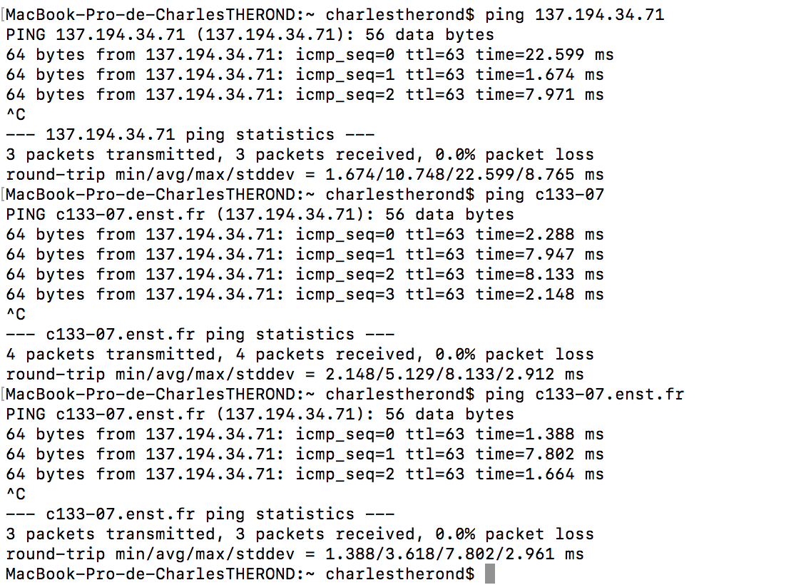
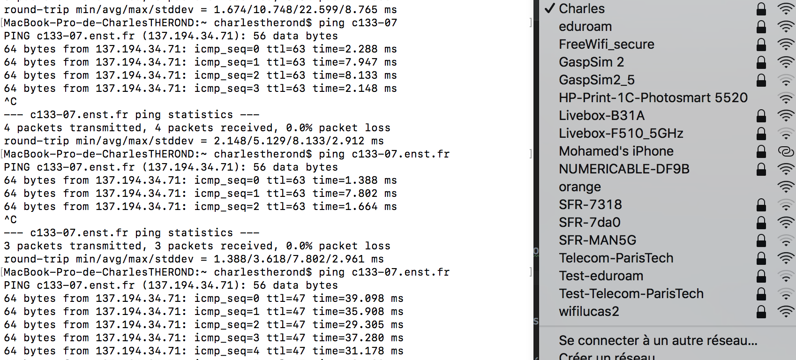

# Compte rendu de tp

## Partie 1

**Question 1:
Quelle structure de donnée est la plus pertinente pour stocker les résultats: List, HashMap ou HashSet ou une autre ? Pour quelle raison ?**

**Question 7:
Quels sont les 5 premiers mots (qui ressemblent à des mots) parmis les 50 premiers de la liste triée résultat ?**

1 de

2 la

3 police

4 et

5 a

**Question 8:
Quels sont les 5 premiers mots (qui ressemblent à des mots) parmis les 50 premiers de la liste triée résultat ?**

1 de

2 le

3 du

4 la

5 et

**Question 9:
Quels sont les 5 premiers mots (qui ressemblent à des mots) parmis les 50 premiers de la liste triée résultat ?**

1 de

2 la

3 des

4 a

5 et

*Question 11:

Quels sont les 5 premiers mots (qui ressemblent à des mots) parmis les 50 premiers de la liste triée résultat ?*

1 the

2 to

3 and

4 of

5 a

## Partie 2

**Question 12:
Quel est le nom COURT de votre ordinateur (le nom simple sans le domaine) ?   quel est le nom LONG de votre ordinateur (le nom avec le domaine) ? Comment les connaître en ligne de commande ? Sur les ordinateurs de l’école, est-il possible d’obtenir ces noms autrement qu’en ligne de commande ?**

Nom court -> hostname -> c133-07

Nom long  -> hostname -d -> enst.fr

Oui il est possible d'acceder à ces informations via dans les parametres réseaux de notre session. Il faut néanmoins posseder les droit pour y acceder

**Question ​13​:
Comment connaître les adresses (plusieurs) IP de votre ordinateur en ligne de commande ? Autrement (en passant par un site internet par exemple) ?**

ifconfig ou ip addr show

​**Question 14:
Comment à partir du nom d’un ordinateur, obtenir les adresses IP en ligne de commande ?**

nslookup 'monhostname'

​**Question 15​:
Comment, à partir d’une adresse IP, obtenir les noms associés en ligne de commande ?**

nslookup 'monip'

​**Question 16:
Testez la communication avec d’autres ordinateurs (pas le vôtre) depuis le réseau de l’école en utilisant la commande ping (pour arrêter le ping faire CTRL + C). suivi du nom court, du nom long, de l’IP. Les trois méthodes fonctionnent-elles ?**

​**Question 17​:
Si vous effectuez le ping depuis un réseau différent, il est possible que celui ne fonctionne pas (filtrage des accès vers le réseau de l’école depuis un réseau extérieur), contactez la DSI pour mettre en place une connection VPN / OpenVPN afin d’être sur le même réseau que les machines en salle de TP.**

**Question ​18:
Comment lancer un calcul en ligne de commande sur votre ordinateur (par exemple 2 + 3) ? Parmi les multiples réponses possibles, lesquelles permettent de lancer le calcul et d’obtenir le résultat en appuyant une seule fois sur la touche <Entrée> ?**

echo "2+3" | bc

​**Question 19:
Comment lancer un calcul  (par exemple 2 + 3) en ligne de commande sur un autre ordinateur (à distance) ? Il faudra certainement vous authentifier avec un mot de passe. Comment obtenir le résultat du calcul immédiatement après avoir tapé son mot de passe ?**

ssh ctherond@c133-07.enst.fr echo "2+3" |bc

**Question ​20:
Comment lancer un calcul à distance en utilisant SSH sans taper le mot de passe et en une seule ligne de commande (c’est à dire qu’on appuie sur <Entrée> et on a le résultat directement)?**

Nous devons enregristrer une cle ( rsa par exemple ), copier la clé publique sur la machine puis executer notre commande \s
ssh-keygen -t rsa -P "" \s
ssh-copy-id -i  ~/.ssh/id_rsa.pub ctherond@c133-07.enst.fr \s
ssh ctherond@c133-07.enst.fr echo "2+3" |bc \s

## Partie 3