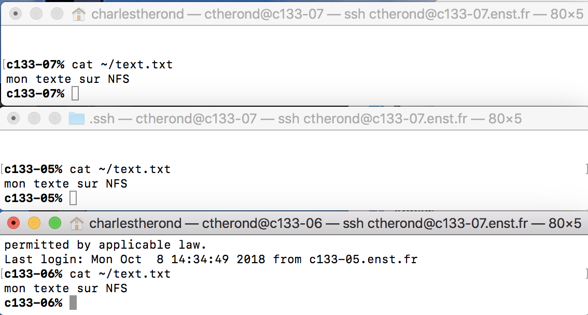
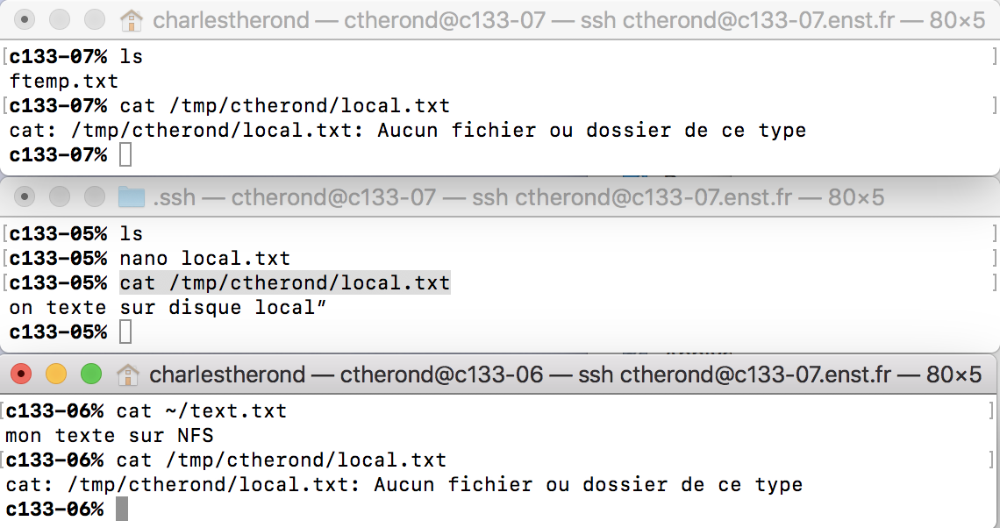
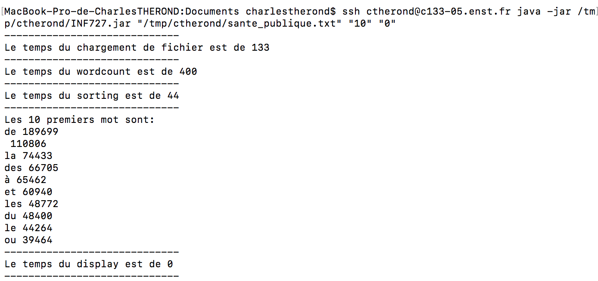

# Compte rendu de tp

## Partie 1

**Question 1:
Quelle structure de donnée est la plus pertinente pour stocker les résultats: List, HashMap ou HashSet ou une autre ? Pour quelle raison ?**

**Question 7:
Quels sont les 5 premiers mots (qui ressemblent à des mots) parmis les 50 premiers de la liste triée résultat ?** 
1 de  
2 la  
3 police  
4 et  
5 a 

**Question 8:
Quels sont les 5 premiers mots (qui ressemblent à des mots) parmis les 50 premiers de la liste triée résultat ?** 
1 de  
2 le  
3 du  
4 la  
5 et  

**Question 9:
Quels sont les 5 premiers mots (qui ressemblent à des mots) parmis les 50 premiers de la liste triée résultat ?** 
1 de  
2 la  
3 des  
4 a  
5 et  

**Question 11:
Quels sont les 5 premiers mots (qui ressemblent à des mots) parmis les 50 premiers de la liste triée résultat ?** 
1 the  
2 to  
3 and  
4 of  
5 a  

## Partie 2

**Question 12:
Quel est le nom COURT de votre ordinateur (le nom simple sans le domaine) ?   quel est le nom LONG de votre ordinateur (le nom avec le domaine) ? Comment les connaître en ligne de commande ? Sur les ordinateurs de l’école, est-il possible d’obtenir ces noms autrement qu’en ligne de commande ?**
 Nom court -> hostname -> c133-07  
Nom long  -> hostname -d -> enst.fr 
Oui il est possible d'acceder à ces informations via dans les parametres réseaux de notre session. Il faut néanmoins posseder les droit pour y acceder

**Question ​13​:
Comment connaître les adresses (plusieurs) IP de votre ordinateur en ligne de commande ? Autrement (en passant par un site internet par exemple) ?**
 ifconfig ou ip addr show

​**Question 14:
Comment à partir du nom d’un ordinateur, obtenir les adresses IP en ligne de commande ?**
 nslookup 'monhostname'

​**Question 15​:
Comment, à partir d’une adresse IP, obtenir les noms associés en ligne de commande ?**
 nslookup 'monip'

​**Question 16:
Testez la communication avec d’autres ordinateurs (pas le vôtre) depuis le réseau de l’école en utilisant la commande ping (pour arrêter le ping faire CTRL + C). suivi du nom court, du nom long, de l’IP. Les trois méthodes fonctionnent-elles ?**
 

​**Question 17​:
Si vous effectuez le ping depuis un réseau différent, il est possible que celui ne fonctionne pas (filtrage des accès vers le réseau de l’école depuis un réseau extérieur), contactez la DSI pour mettre en place une connection VPN / OpenVPN afin d’être sur le même réseau que les machines en salle de TP.**
 

**Question ​18:
Comment lancer un calcul en ligne de commande sur votre ordinateur (par exemple 2 + 3) ? Parmi les multiples réponses possibles, lesquelles permettent de lancer le calcul et d’obtenir le résultat en appuyant une seule fois sur la touche <Entrée> ?** 
echo "2+3" | bc

​**Question 19:
Comment lancer un calcul  (par exemple 2 + 3) en ligne de commande sur un autre ordinateur (à distance) ? Il faudra certainement vous authentifier avec un mot de passe. Comment obtenir le résultat du calcul immédiatement après avoir tapé son mot de passe ?** 
ssh ctherond@c133-07.enst.fr echo "2+3" |bc

**Question ​20:
Comment lancer un calcul à distance en utilisant SSH sans taper le mot de passe et en une seule ligne de commande (c’est à dire qu’on appuie sur <Entrée> et on a le résultat directement)?**
 Nous devons enregristrer une cle ( rsa par exemple ), copier la clé publique sur la machine puis executer notre commande  
ssh-keygen -t rsa -P ""  
ssh-copy-id -i  ~/.ssh/id_rsa.pub ctherond@c133-07.enst.fr   
ssh ctherond@c133-07.enst.fr echo "2+3" |bc   

## Partie 3

**Question 21:
Quel est le chemin absolu de votre répertoire personnel, votre home directory ?**
 /cal/homes/ctherond

**Question ​22:
Créez un fichier fperso.txt contenant le texte “bonjour” dans votre répertoire personnel (sur un ordinateur de l’école).
Vérifiez le contenu du fichier avec cette commande exactement:**
 nano fperso.txt  
cat ~/fperso.txt

​**Question 23:
Ce fichier est-il sur le disque dur de l’ordinateur ou autre part ? Comment savoir où est stocké physiquement ce fichier, à l’aide de quelle commande ?** 
Le fichier est sur stoqué sur le serveur nfs dans le dossier relié à mon compte 
realpath fperso.txt -> /cal/homes/ctherond/fperso.txt

**Question ​24:**

Créez un dossier /tmp/<votre nom d’utilisateur> en remplaçant <votre nom d’utilisateur>. 
mkdir /tmp/ctherond 
Créez un fichier ftemp.txt dans le répertoire /tmp/<votre nom d’utilisateur> . 
cd /tmp/ctherond 
nano ftemp.txt 
Vérifiez le contenu du fichier avec cette commande exactement: 
cat /tmp/ctherond/ftemp.txt 
**Ce dossier et ce fichier sont-ils sur le disque dur de l’ordinateur ou autre part ? Comment savoir où sont stockés physiquement ces éléments, à l’aide de quelle commande ?**
 /tmp/ctherond/ftemp.txt 
Le fichier est stoqué sur la machine localement

​**Question 25:​
Pour les questions suivantes, utilisez trois ordinateurs: A, B C.
Connectez vous physiquement (avec un clavier, une souris et un écran) sur l’ordinateur A.
Sur A, créez un fichier text.txt contenant le texte “mon texte sur NFS” dans votre répertoire personnel.
Vérifiez que le fichier existe et vérifiez son contenu. Pour cela, sur A, utilisez la commande :** 
cat ~/text.txt 
Pour le reste du sujet:  
A -> c133-05.enst.fr 
B -> c133-06.enst.fr 
C -> c133-07.enst.fr 

**Question ​26:
Connectez-vous à B (physiquement ou à distance) et vérifiez que le fichier text.txt est également présent dans votre répertoire personnel. Pour cela, sur B, utilisez la commande :
cat ~/text.txt
De même, connectez-vous à C et vérifiez que text.txt est aussi présent.
Remarquez que vous n’avez pas copié le fichier mais qu’il est présent sur A, B et C grâce au serveur NFS.** 

​**Question 27 et 28:​ 
Déconnectez vous de B et de C et revenez sur l’ordinateur A.
Sur A, créez un dossier /tmp/<votre nom d’utilisateur> et un fichier local.txt contenant le texte “mon texte sur disque local” dans ce dossier /tmp/<votre nom d’utilisateur>.
Vérifiez que le fichier existe et vérifiez son contenu. Pour cela, sur A, utilisez la commande :
cat /tmp/<votre nom d’utilisateur>/local. 
Connectez-vous à B et C (physiquement ou à distance) et vérifiez que le dossier <votre nom d’utilisateur> ainsi que le fichier local.txt ne sont pas présent dans /tmp . Pour cela vérifiez avec la commande:
ls /tmp**

​**Question 29:
Comment, à partir de A, transférer le fichier /tmp/local.txt sur B (dans /tmp/<votre nom d’utilisateur>/local.txt) en utilisant scp ? Vérifiez que le fichier est bien présent sur B. Attention: si vous avez une erreur “no such file or directory” (ou l’équivalent français), vous devez d’abord créer le répertoire /tmp/<votre nom d’utilisateur>/ avec la commande mkdir -p associée à un ssh pour l’ordinateur distant.** 
scp /tmp/ctherond/local.txt ctherond@c133-06.enst.fr:/tmp/ctherond

​**Question 30:
Comment, à partir de A, transférer le fichier de B (depuis /tmp/<votre nom d’utilisateur>/local.txt) vers C (dans /tmp/<votre nom d’utilisateur>/local.txt) ? Vérifiez que le fichier est bien présent sur C. De même que la question précédentes, vous devez créer les répertoires /tmp/<votre nom d’utilisateur>/ correspondants.** 
scp ctherond@c133-06.enst.fr:/tmp/ctherond/local.txt ctherond@c133-07.enst.fr:/tmp/ctherond

## Partie 4

**Question ​34​:
Depuis la machine A contenant /tmp/<votre nom d’utilisateur>/slave.jar
Créez à distance sur la machine B (s’il n’existe pas) un répertoire /tmp/<votre nom d’utilisateur>/
Copiez slave.jar sur la machine B dans le répertoire /tmp/<votre nom d’utilisateur>/
Exécutez à distance (depuis A sur la machine B) le slave.jar.
Quelle est la commande tapée pour effectuer cette dernière action ?** 

La commande est **ssh ctherond@c133-05.enst.fr java -jar /tmp/ctherond/INF727.jar "/tmp/ctherond/sante_publique.txt" "10" "0"** 
Les résultats obtenus sont: 

## Partie 5

**Question 37​
Modifiez votre programme “MASTER” pour qu’il lance “SLAVE”, c’est à dire slave.jar situé sur la même machine que “MASTER” dans le dossier** 

